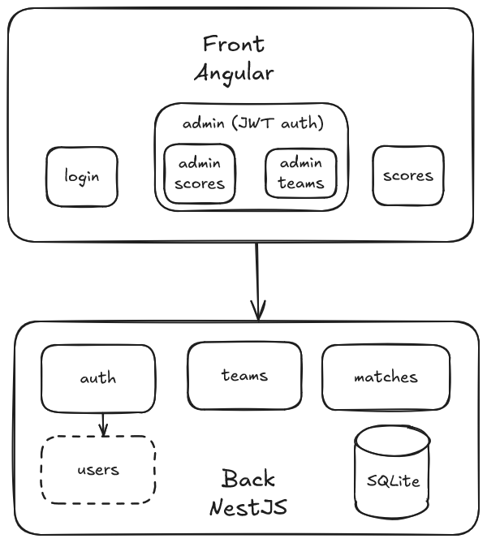

# LOGBOOK

## Overview

This project consists of a front-end built with **Angular** and a back-end built with **NestJS**, with an integrated **SQLite database** for data persistence.

### Front-End

The front-end application has four main pages:

-   **Scores Consultation**: View the results of matches.
-   **Teams Management**: Manage teams.
-   **Scores Management**: Manage scores.
-   **Login**: User authentication.

### Back-End

The back-end application provides three main services with REST APIs:

-   **Auth Service**: Handles user authentication with JWT.
-   **Matches Service**: Manages match data, including creation, updates, and retrieval. It also includes a WebSocket for triggering client refreshes when matches are updated or created.
-   **Teams Service**: Manages team data, including creation and retrieval.

## Stages of reflexion

### Design and integration

I spent a bit too much time defining the design of the application. I mainly relied on sports or online betting websites. I followed the mobile-first principle to define the main organizational outlines.

I hesitated to use Tailwind to facilitate the styling of my application, but I hadn't used it for a long time and I was afraid of wasting time relearning how to use it.

I defined variables in the global style of the application to harmonize the variables and fonts across all components.

### Routing

The instructions provided clear guidelines on structuring the application into three pages: one for score consultation, one for score management, and one for team consultation/creation. I added a login page, which is more responsive than modals.

### Back-End

On the back-end, I divided the project into three services: authentication, teams, and scores. A fourth internal service manages users and is used by the authentication service.

For authentication, I initially started with Basic Auth, but the implementation of JWT authentication is well-documented for NestJS and was done quite easily.

The management of token validation on the front end was more troublesome and made me regret not choosing a simpler option.

For data refresh, I quickly turned to a WebSocket to inform the client of any modifications. The front-end integration of WebSocket has been relatively easy.

### Data persistency

I took a bit more time to set up data persistence with an integrated SQLite database in NestJS. SQLite has the advantage of being serverless and lightweight.

However, I encountered issues with SQLite during the dockerization of the application, which caused me to lose quite a bit of time.

## Areas for improvement

-   Unit tests are very partial: services on the NestJS and Angular sides are covered, but there are no tests on the components.
-   Some elements are not responsive, such as the navlinks that should have been moved in a burger menu in mobile mode.
-   On the Angular side, some blocks could have been externalized into components, such as inputs. The styles of too many elements are defined in the global style of the application (`elements.scss`).
-   Accessibility needs to be completed.
-   Internationalization.
-   Authentication needs improvement: passwords are not encrypted (use bcrypt, for example). The management of authentication and redirections on the Angular side is not sufficiently centralized.
